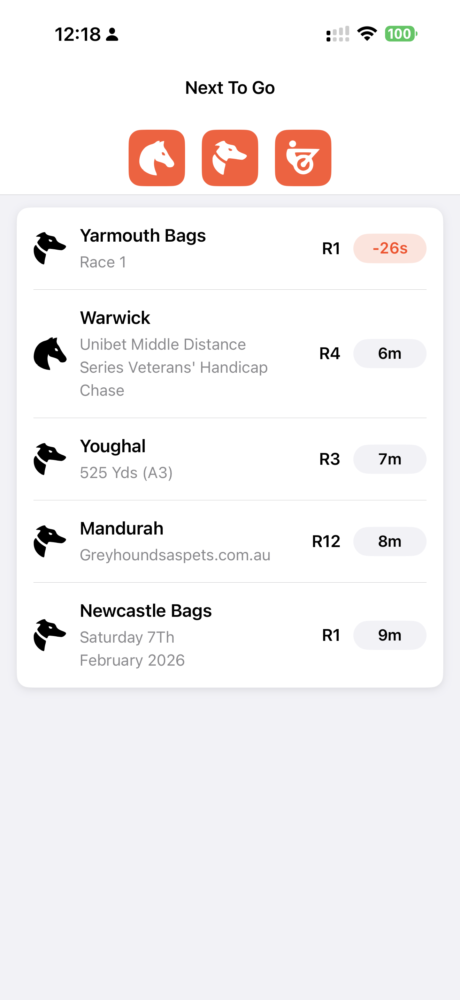
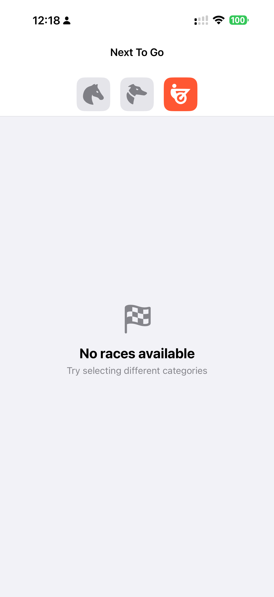
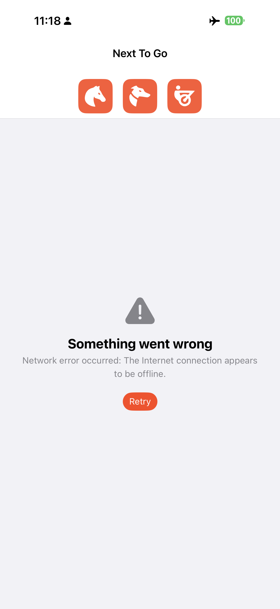

# Next To Go Races

A native iOS app displaying the next 5 upcoming races with category filtering, smart debouncing, and full accessibility support.

**Tech Stack:** Swift 6 | SwiftUI | Clean Architecture | Actor-based Concurrency

---

## 📱 App Demo

<!-- Add your screenshots/videos here -->

### Screenshots
<table>
  <tr>
    <td><br/><em>Main screen with race list</em></td>
    <td><br/><em>Empty State</em></td>
    <td><br/><em>Error State</em></td>
  </tr>
</table>

### Demo Video

[](https://www.youtube.com/watch?v=osR6DAl9qCg)

---

## ✨ Key Features

**Core Functionality:**
- Next 5 races sorted by start time (secondary sort by race name)
- Category filtering (Horse, Harness, Greyhound) with real-time refresh
- Countdown timer updating every second
- Auto-remove races 60 seconds after start
- 500ms debouncing prevents excessive API calls

**Technical Highlights:**
- ♿️ **Full Accessibility**: VoiceOver with smart announcements, Dynamic Type (-3 to +12), WCAG AA colour contrast
- 🎨 **Adaptive Layouts**: Auto-switches horizontal ↔ vertical layout based on text size, height-dynamic rows
- 🏗️ **Clean Architecture**: 5 modular packages (Core → Networking → Repository → ViewModel → UI)
- ⚡️ **Swift 6 Concurrency**: Actor-based networking, complete data race safety at compile time
- 🧪 **Well Tested**: 69/69 tests passing (100%), comprehensive mock infrastructure
- 🔄 **CI/CD**: Automated testing and build verification on every PR

**Custom SF Symbols** using official Neds brand icons for racing categories.

---

## 🚀 Quick Start

```bash
# Clone repository
git clone https://github.com/datkinnguyen/entain-ios-task.git
cd entain-ios-task

# Open in Xcode
open NextToGoRaces.xcodeproj

# Build and run: ⌘R
# Run tests: ⌘U
```

**Requirements:** iOS 18.0+ | Xcode 16.2+ | Swift 6.0+ | macOS 14.0+

---

## 🤖 Development Process

**This project was developed using Claude Code AI throughout the entire implementation.**

### How Claude Code Was Used

**Planning & Documentation:**
- Complete implementation plan documented in [`Documentation/IMPLEMENTATION_PLAN.md`](./Documentation/IMPLEMENTATION_PLAN.md)
- 12 structured tasks with clear deliverables and acceptance criteria
- All architectural decisions documented upfront before coding

**Code Quality Enforcement:**
- Coding conventions defined in [`Documentation/CODING_GUIDELINES.md`](./Documentation/CODING_GUIDELINES.md)
- Claude Code follows these guidelines for all code generation
- SwiftLint configuration ensures consistent code style (0 violations maintained)
- Pre-commit checks: SwiftLint + all tests must pass

**Quality Assurance:**
- **Every change reviewed via Pull Request** - no direct commits to main
- **Manual PR approval required** - human review ensures production quality
- **Automated CI/CD** on GitHub Actions validates all changes
- **Comprehensive testing** - 69 unit tests covering all domain logic

This approach ensures **high-quality, production-ready code** while leveraging AI for rapid development.

---

## 🏗️ Technical Architecture

```
NextToGoRaces (App)
    ↓
NextToGoUI (SwiftUI Views)
    ↓
NextToGoViewModel (@Observable State)
    ↓
NextToGoRepository (Business Logic)
    ↓
NextToGoNetworking (Actor-based API) + NextToGoCore (Domain Models)
```

**Key Technologies:**
- **Swift 6** with strict concurrency checking
- **SwiftUI** with `@Observable` macro (no ObservableObject boilerplate)
- **Actor-based networking** for thread-safe API calls
- **Structured concurrency** (TaskGroup, AsyncStream) for background tasks
- **Dependency injection** for testability

See [`Documentation/ARCHITECTURE.md`](./Documentation/ARCHITECTURE.md) for detailed technical architecture.

---

## 🧪 Testing & CI/CD

**Test Coverage:** 69/69 tests passing (100%)
- NextToGoCore: 9/9 tests
- NextToGoNetworking: 23/23 tests
- NextToGoRepository: 7/7 tests
- NextToGoViewModel: 30/30 tests

**CI/CD Pipeline:** [](https://github.com/datkinnguyen/entain-ios-task/actions)
- Automated testing on every PR
- Swift 6.0 compatibility checks
- Build verification for simulator and device

See [`Documentation/TESTING.md`](./Documentation/TESTING.md) for testing strategy and guide.

---

## 📋 Assumptions & Design Decisions

### API Limitation: No Category Filtering
The v1 API (`/rest/v1/racing/?method=nextraces`) does not support filtering by `category_ids`.

**Workaround:** Fetch 2x races (10 instead of 5) and filter client-side to increase likelihood of having 5 items. This approach is **totally dependent on data from the backend** and is currently **limited by API capability**. May occasionally show <5 races for single-category filters until next refresh.

**Note:** Official Neds app uses v2 API with native category filtering support.

### UI Design Philosophy
**This implementation prioritises technical capability demonstration over exact visual parity with the official app.**

**Focus Areas:**
- ✅ Full Dynamic Type support (all text scales/wraps properly)
- ✅ Complete accessibility (VoiceOver, VoiceControl, colour contrast)
- ✅ Dark Mode support
- ✅ Adaptive layouts (horizontal ↔ vertical based on text size)
- ✅ No content truncation (height-dynamic rows show all information)

The UI showcases iOS development best practices and accessibility implementation rather than replicating the exact visual design of the production app. Fields displayed and styling may differ from the official Neds app.

---

## 📚 Documentation

All documentation in [`Documentation/`](./Documentation/) folder:

- **[ARCHITECTURE.md](./Documentation/ARCHITECTURE.md)** - Technical architecture and design patterns
- **[CODING_GUIDELINES.md](./Documentation/CODING_GUIDELINES.md)** - Swift 6 concurrency, SwiftUI patterns, coding standards
- **[TESTING.md](./Documentation/TESTING.md)** - Testing strategy and guide
- **[CONTRIBUTING.md](./Documentation/CONTRIBUTING.md)** - PR workflow and contribution guidelines
- **[IMPLEMENTATION_PLAN.md](./Documentation/IMPLEMENTATION_PLAN.md)** - Complete implementation plan (12 tasks)

---

## 🎯 Project Status

### ✅ Completed (Production Ready)
- [x] 5 modular Swift packages with clean architecture
- [x] Full feature implementation (filtering, countdown, auto-refresh, debouncing)
- [x] Comprehensive accessibility support (VoiceOver, Dynamic Type)
- [x] 69 unit tests (100% passing)
- [x] SwiftLint integration (0 violations)
- [x] GitHub Actions CI/CD pipeline
- [x] Complete documentation
- [x] Performance profiling and memory leak detection
- [x] UI polish and edge case testing

### 💡 Future Enhancements (Out of Scope)
- Adopt Liquid Glass UI design system (iOS 26+) for modern, fluid appearance with adaptive transparency and tinting
- Race details screen
- International or AU/NZ filter (matching official Neds app)
- Show more race card details (matching official Neds app)
- Network connection monitoring: Automatically retry failed requests when internet connection is restored (useful for timeout/offline scenarios)

---

## 📜 License

MIT License - see LICENSE file for details.

## 📧 Contact

**Dat Nguyen**
Email: tiendat26@gmail.com

---

*🤖 Built with [Claude Code](https://claude.com/claude-code) - AI-assisted development with human oversight*
